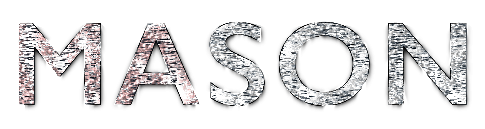

# MASON: Mort's Adorable and Sensible Object Notation

MASON is a JSON variant which aims to be well-suited for humans to read and write.
Its main purpose is for config files and other human-written mediums,
while being backwards compatible with JSON.

## Features

MASON example:

```
name: "My Document"
windowsPath: r"C:\Users\MASON\"
fileMode: 0o755 // World readable, owner-writable
tags: [
    "cool"
    "mason"
    "document"
]
content: b"abcd\x45\xf7"
```

The main things which differentiate MASON from JSON are:

* Object keys can be unquoted identifiers: `{hello: "world"}`
* The outermost layer of braces can be omitted:

```
look: "ma",
no: "braces",
```

* Values can be separated by newlines or commas:

```
hello: "world"
this: "is MASON"
and: "this", is: "MASON"
```

* Also in arrays:

```
myarray: [
    "Lots of values"
    "separated by newlines"
    "and some by comma",
    1, 2, 3, 4,
]
```

* Comments:

```
// This is a comment
this: "is a value" // Another comment
```

* Raw strings: `{regex: r"\s*MASON\s*"}`
* Rust-style raw strings: `r##"This "string" can fit so many #"quotes"# :)"##`
* Binary strings: `b"look at my values: \xff\xfe\xef\x00"`
* Hex, binary and octal: `0xffef`, `0b00101101`, `0o755`
* Decimals with omitted leading zero: `.34`
* Leading positive sign: `+0.3`, `-.7`, `+.9`

## Syntax

See [mason.bnf](./mason.bnf) for a description of the MASON syntax in BNF.

See [mason.png](./mason.png) for a railroad diagram rendered from the BNF.

## Implementations

* [mason-js](https://github.com/mortie/mason-js),
  a JavaScript parser implementation
* [mason-cpp](https://github.com/mortie/mason-cpp),
  a C++ parser and serializer implementation
* [mason-rs](https://github.com/Emilinya/mason-rs/),
  a Rust parser implementation

## Comparison with other JSON-like formats

I will not evangelize for MASON and tell you to abandon all other formats.
However, there are reasons why I chose to make a new format instead of
just using the existing ones.
(And it's not *just* that I like defining grammars and writing parsers,
although that does play a role)

### TOML

Honestly, TOML is great.
If you're looking for something INI-like instead of something JSON-like,
and JSON backwards compatibility has no value to you,
you should probably just use TOML.

I just hope they actually
[release TOML 1.1.0](https://github.com/toml-lang/toml/issues/928) soon,
there are lots of improvements in TOML 1.1 that makes it
a significantly better language than TOML 1.0...

### JSON5

Before making MASON, [JSON5](https://json5.org/) was my preferred JSON-like format.
I even wrote [Json5Cpp](https://github.com/mortie/json5cpp),
a parser and serializer for it.
I think it's pretty good, but there are a few things that annoy me:

* I don't like that it requires comma separators.
  Removing the commas gives the file a much cleaner look, in my opinion.
* I don't like that its spec relies on Unicode character classes.
  When writing a parser, I do *not* want to add a dependency on a
  Unicode character database.
  If a program uses JSON5 for its config file format,
  the JSON5 parser would, in many cases, be the *only* reason for it to depend
  on a Unicode character database.
* Since JSON5 defers to the ECMAScript spec for identifier names,
  it has weird rules like disallowing using the words "default" or "with" as
  unquoted identifiers.
  (Even JavaScript object syntax doesn't have this restriction!)

### Hjson

[Hjson](https://hjson.github.io/) is another JSON alternative that's meant to
be nicer for humans to read and write than JSON.
I like this one less than JSON5,
mostly because it allows unquoted strings.
I *really* don't like unquoted strings in schemaless formats.
It gives rise to issues like
[YAML's infamous Norway problem](https://www.bram.us/2022/01/11/yaml-the-norway-problem/).
It also makes it difficult for me as a human to parse a document since I need
to memorize rules for which exact symbols are allowed in which parts of
an unquoted string.
No thanks.

### HOCON

[HOCON](https://github.com/lightbend/config/blob/main/HOCON.md)
seems way over-complicated to me.
It shares the "unquoted strings" problem of Hjson,
and the reliance on a Unicode character database problem of JSON5.
It has "enterprise Java" vibes, with the ability to include stuff
from arbitrary URLs, and it can include data from Java class files by class path.

It's not my cup of tea.

### Various non-standard "JSON with comments" type formats

I mean, these are alright.
But since they aren't really proper documented formats,
they can cause interoperability issues when different tools
written in different languages want to read the same JSON-with-comments file.
"JSON with comments" usually ends up being "whatever my chosen JSON library
happens to do when I enable its comments feature".

If you do want just "JSON with comments",
at least try to follow
[JWCC](https://nigeltao.github.io/blog/2021/json-with-commas-comments.html).

### YAML

Just... No.

Enough collective ink has been spilled criticising the YAML file format.
If you somehow like YAML, use it. I won't.

## Semantics

* MASON parsers MUST be able to uniquely parse all numbers that IEEE 754
  double-precision floating point numbers can represent.
* MASON parsers MAY preserve the ordering of key-value pairs in objects,
  but are not required to.
  Changing the order of keys is not considered a change
  in the semantic meaning of the document.
* Whether or not the outermost layer of braces are omitted has no effect
  on the semantic meaning of a MASON document.
* A string can represent any sequence of Unicode code points.
  This includes U+0000.
* A binary string can represent any arbitrary sequence of bytes.
  This includes the 0 byte, and it includes byte sequences which are invalid UTF-8.
* When converting a MASON document to a JSON document,
  binary strings SHOULD be encoded as base64 in accordance with RFC 4648.
* Like in JSON, two `\u` escape sequences can be used to encode a single
  Unicode code point by encoding two UTF-16 surrogate pairs.
  For example, a string containing the Upside Down Face emoji (🙃, U+1F643)
  can be encoded in 3 ways: the literal emoji in the string `"🙃"`,
  the single `\U` escape `"\U01F643"`,
  or the surrogate pair sequence `"\uD83D\uDE43"`.
